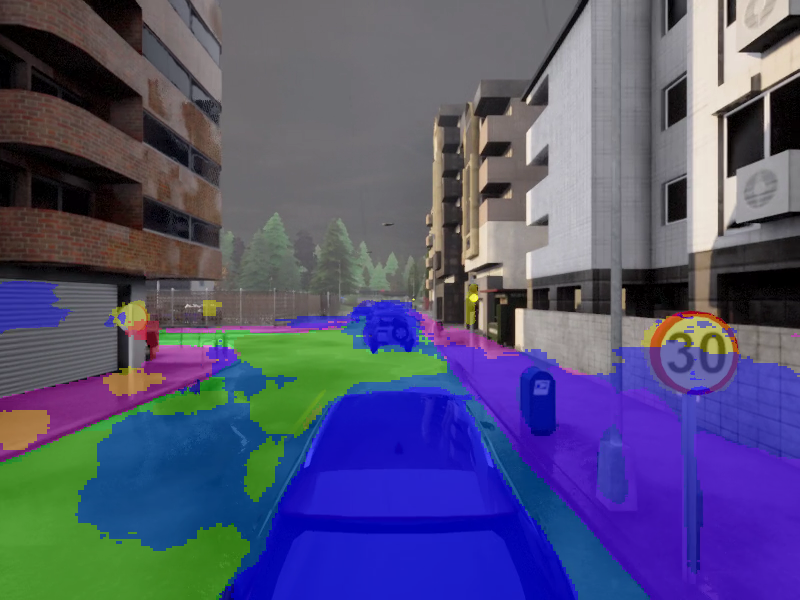
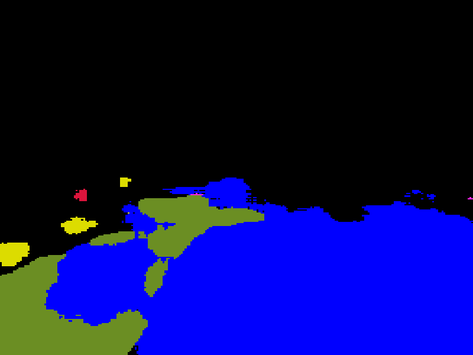
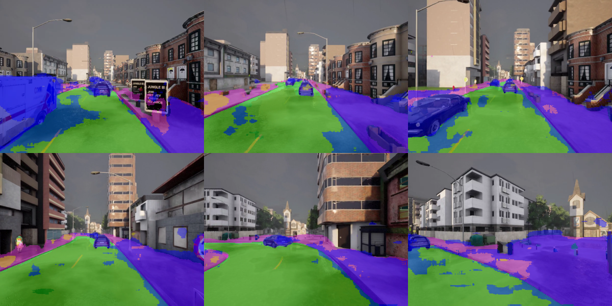

# 自动驾驶车辆语义分割

基于 **U-Net** 与 **CARLA 自动驾驶仿真平台** 的逐像素语义分割模块。本项目源自伍斯特理工学院（WPI）研究生课程 **RBE549 计算机视觉**，作业要求团队选定一个计算机视觉课题作为期末研究，本团队选择"自动驾驶场景下的语义分割"作为切入点：通过自动化脚本在 CARLA 仿真器中批量采集数千张带标注的街景图像，构建语义分割数据集，训练 U-Net 模型，并对比不同损失函数与超参数下的模型表现。

模块代码位于仓库的 [`src/auto_drive_seg/`](https://github.com/OpenHUTB/nn/tree/main/src/auto_drive_seg)。

## 目录
- [项目背景](#background)
- [解决的问题](#problem)
- [技术方案](#approach)
- [运行效果](#results)
- [类别定义与配色](#categories)
- [运行环境与使用](#usage)
- [项目结构](#structure)
- [参考资料](#references)

## 项目背景 <a name="background"></a>

自动驾驶车辆需要从摄像头视频中实时理解周围环境：哪里是道路、哪里是人行道、前方车辆和行人的位置——这些都是规划与控制的前置信息。**语义分割（Semantic Segmentation）** 把图像逐像素分到一个语义类别，是这一感知任务的标准解法。

但直接在真实道路上采集带标注的图像代价高昂，本项目选用 **CARLA 自动驾驶仿真平台** 作为数据源：CARLA 不仅提供逼真的 3D 城市环境，还自带"语义分割相机"传感器，能在采集 RGB 图的同时一并产出像素级的真实标签，省掉手工标注的开销。

## 解决的问题 <a name="problem"></a>

1. **从 0 构建语义分割数据集** — CARLA 自带标签但需要遍历地图、控制天气与交通流量、按固定频率采样，确保数据多样性；本项目用自动化脚本在多张地图、随机车流人流条件下批量采集了数千张图像。
2. **类别极度不平衡** — 街景图像里"道路"和"建筑"占据绝大多数像素，"行人""交通标志"等关键类别只占极少数。直接训练会让模型偏向输出多数类，关键类目几乎学不到。
3. **小目标识别** — 交通标志、远处行人等小目标在 600×800 全图里只占百级像素，下采样后信息丢失严重。

## 技术方案 <a name="approach"></a>

### 网络结构：U-Net
采用经典 **U-Net** 编码-解码结构（[`src/auto_drive_seg/semantic/unet/model.py`](https://github.com/OpenHUTB/nn/blob/main/src/auto_drive_seg/semantic/unet/model.py)）：

- **下采样路径**：3 个残差块，特征通道 64 → 128 → 256，每块使用 SeparableConv2D + BatchNorm + ReLU，配合 MaxPool 缩小特征图
- **上采样路径**：对应 4 个上采样块，使用 Conv2DTranspose + UpSampling 还原空间分辨率，并通过残差连接保留细节
- **输出层**：1×1 卷积 + softmax，逐像素输出 8 类概率

### 损失函数：Sparse Categorical Focal Loss
为解决类别不平衡，采用 **Focal Loss** 替代普通交叉熵：

\[
\mathrm{FL}(p_t) = -\alpha_t (1 - p_t)^\gamma \log(p_t)
\]

其中 \((1 - p_t)^\gamma\) 项把"容易分对"的样本（多数类的道路像素）的权重压低，让模型聚焦于"难分对"的样本（少数类的行人、交通标志）。本项目设 \(\gamma=2.0\)，并额外为每个类别赋予基于像素频率倒数的权重（用 sigmoid 映射到 0–2 区间），细节见 [`semantic/unet/train.py`](https://github.com/OpenHUTB/nn/blob/main/src/auto_drive_seg/semantic/unet/train.py)。

### 数据增强
训练时对每张图随机施加 6 种增强（[`semantic/unet/dataset.py`](https://github.com/OpenHUTB/nn/blob/main/src/auto_drive_seg/semantic/unet/dataset.py)）：水平翻转、亮度 ±40%、对比度 -40%、高斯模糊半径 0–5、椒盐噪声 0–7%、以及"中心区域裁剪缩放"（针对小目标识别）。

## 运行效果 <a name="results"></a>

### 单张图片：语义分割叠加
输入一张 CARLA 街景图，模型输出每个像素的类别预测，并叠加在原图上。蓝色为车辆、绿色为道路/地面、红色为行人、黄色为交通标志：

<p align="center">

</p>

### 单张图片：纯掩码
仅显示分割结果（不带原图），便于直观观察模型输出：

<p align="center">

</p>

### 视频逐帧分割
模块支持视频输入，自动按扩展名识别 `.mp4 / .avi / .mov / .mkv / .webm`，逐帧推理后输出叠加视频与采样帧拼图。下图为一段 CARLA 行驶视频中 6 个均匀采样帧的分割结果：

<p align="center">

</p>

## 类别定义与配色 <a name="categories"></a>

本项目将 CARLA 默认的 23 类语义标签归并为 8 类，便于自动驾驶决策使用：

| ID | 类别 | 颜色 (R, G, B) |
|----|----|------|
| 0 | 未标注 (Unlabeled) | (0, 0, 0) |
| 1 | 交通标志/灯 (Traffic Sign/Lights) | (220, 220, 0) |
| 2 | 道路 (Roads) | (0, 255, 0) |
| 3 | 车道线 (Road Lines) | (157, 234, 50) |
| 4 | 人行道 (Sidewalk) | (244, 35, 232) |
| 5 | 地面 (Ground) | (107, 142, 35) |
| 6 | 车辆 (Vehicles) | (0, 0, 255) |
| 7 | 行人 (Pedestrians) | (220, 20, 60) |

完整 CARLA → 本项目类别映射见 [`semantic/carla_controller/labels.py`](https://github.com/OpenHUTB/nn/blob/main/src/auto_drive_seg/semantic/carla_controller/labels.py)。

## 运行环境与使用 <a name="usage"></a>

- 平台：Windows 10/11 或 Linux
- Python 3.10（TensorFlow 2.10 要求 Python 3.7–3.10）
- 纯 CPU 即可推理，无需 GPU

```bash
conda create -n py310 python=3.10 -y
conda activate py310
cd src/auto_drive_seg
pip install -r requirements.txt
# 国内网络可加清华镜像：-i https://pypi.tuna.tsinghua.edu.cn/simple

# 按 README 从 hlfshell/rbe549-project-segmentation 取一个预训练模型放入 models/
python main.py                                # 默认示例图
python main.py examples/sample_input.png      # 指定图片
python main.py path/to/video.mp4              # 视频逐帧分割
```

预训练模型为二进制大文件（每个约 17MB），按仓库规范不入仓，模块 README 已说明如何从原始项目 [hlfshell/rbe549-project-segmentation](https://github.com/hlfshell/rbe549-project-segmentation) 的 `models/` 目录获取。

## 项目结构 <a name="structure"></a>

```
src/auto_drive_seg/
    main.py                 推理入口（按 OpenHUTB 规范以 main. 开头）
    requirements.txt        依赖清单
    semantic/               推理与训练核心代码
        unet/
            model.py            U-Net 编码-解码结构
            dataset.py          CARLA 数据生成器 + 数据增强
            train.py            训练循环 + Focal Loss + 类别权重
            utils.py            推理、可视化、掩码上色
        carla_controller/
            labels.py           CARLA → 8 类语义类别映射与配色
    examples/               示例输入图与运行效果图
    models/                 预训练模型（需自行获取，见上）
```

> 说明：原始项目中 `semantic/carla_controller/` 还含有 CARLA 数据采集脚本（依赖 `carla` 包与运行中的仿真器），与推理无关，本仓库未收录。训练数据集需通过 CARLA 仿真器实跑采集，详见原始项目。

## 参考资料 <a name="references"></a>

- 原始项目：[hlfshell/rbe549-project-segmentation](https://github.com/hlfshell/rbe549-project-segmentation)
- U-Net 论文：Ronneberger O. et al., *U-Net: Convolutional Networks for Biomedical Image Segmentation*, MICCAI 2015
- Focal Loss 论文：Lin T. et al., *Focal Loss for Dense Object Detection*, ICCV 2017
- CARLA 模拟器：[https://carla.org/](https://carla.org/)
- CARLA 语义分割相机：[https://carla.readthedocs.io/en/latest/ref_sensors/#semantic-segmentation-camera](https://carla.readthedocs.io/en/latest/ref_sensors/#semantic-segmentation-camera)
