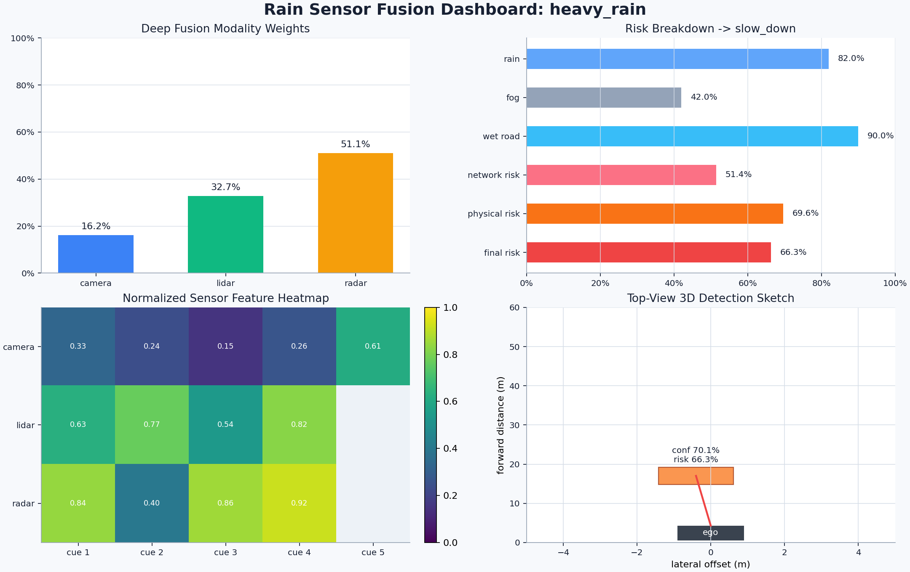
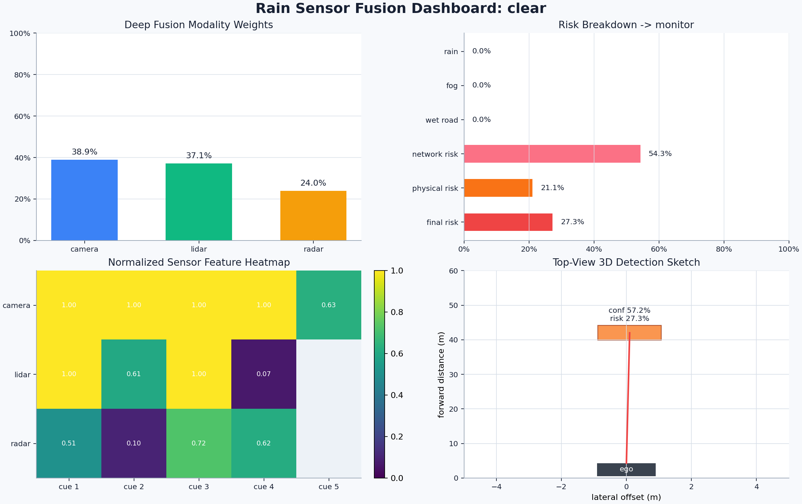
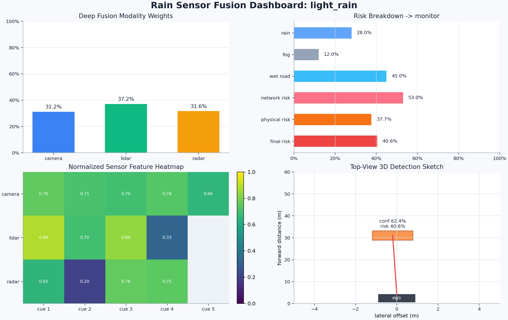
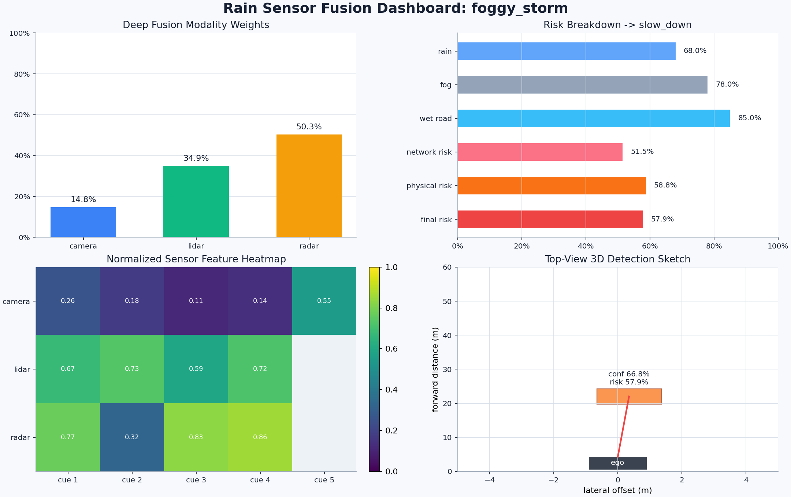
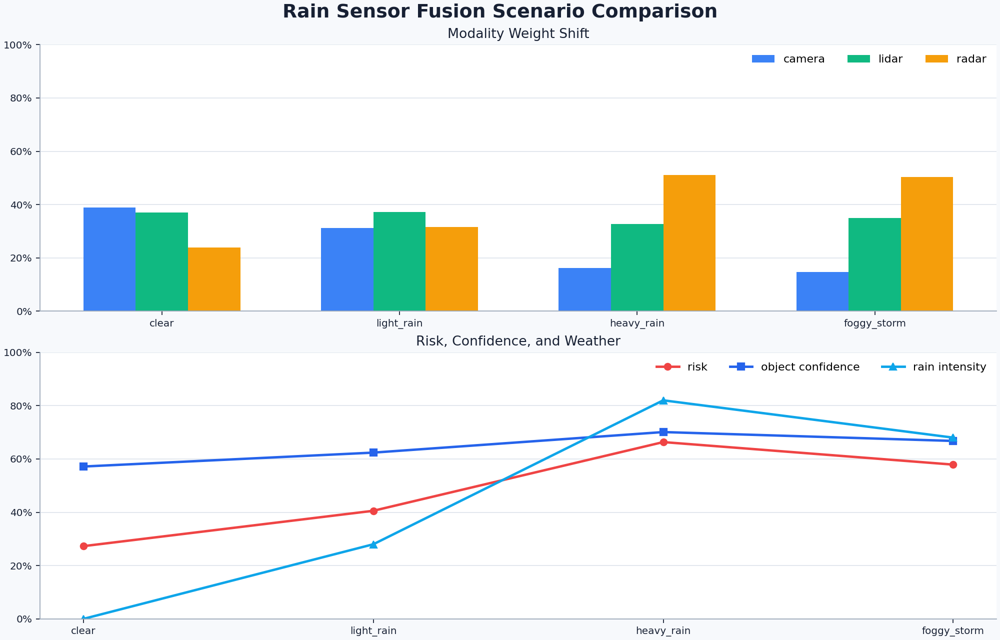
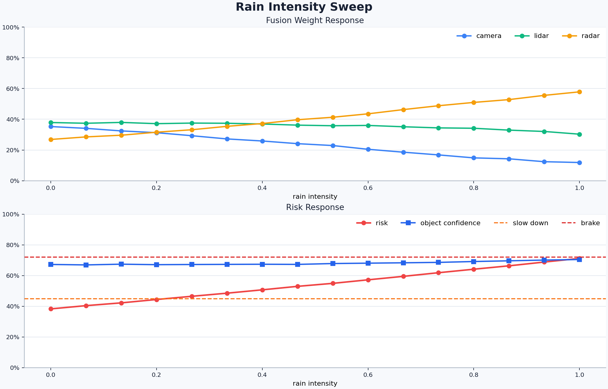

# 基于深度学习置信度加权的自动驾驶雨天多传感器融合感知优化

## 1. 汇报摘要

本项目面向自动驾驶车辆在雨天、雾天和湿滑路面下的感知可靠性下降问题，设计并实现了一个轻量级深度学习多传感器融合系统。系统融合 RGB 相机、LiDAR 和毫米波雷达三类传感器特征，并结合雨量、雾气和路面湿滑程度，动态调整不同传感器的置信权重，输出目标置信度、粗 3D 检测框、风险评分和驾驶动作建议。

本次演示重点展示三点：

1. 雨天环境下，相机可靠性下降，系统会自动提升雷达和 LiDAR 权重。
2. 近距离、高闭合速度目标会使风险评分显著升高。
3. 可视化结果能够直观展示模型决策过程，便于解释和汇报。

## 2. 研究背景

自动驾驶感知系统在晴天环境下通常依赖相机进行车道线、目标外观和交通标志识别。但在雨天场景中，图像会受到雨滴、雾气、积水反光和低对比度影响，导致视觉特征退化。LiDAR 在强雨中也会出现点云稀疏、飞溅噪声和反射异常。毫米波雷达虽然空间分辨率较低，但在雨雾环境中具有更好的穿透性和速度感知能力。

因此，本课题的核心问题是：**如何让自动驾驶感知系统根据天气和传感器质量，动态决定更相信哪个传感器？**

## 3. 项目目标

本项目在原 `rain_sensor_fusion` 目录基础上新增完整代码和实验结果，实现以下目标：

- 构建可运行的雨天多传感器融合深度学习模型；
- 模拟晴天、小雨、大雨、雨雾四类典型驾驶场景；
- 输出相机、LiDAR、雷达三类传感器的动态融合权重；
- 输出目标检测置信度、风险评分和动作建议；
- 生成可用于汇报展示的可视化图表。

## 4. 技术路线

系统整体流程如下：

```text
雨天场景参数
  ├── rain intensity
  ├── fog density
  └── wet road level
        ↓
合成多传感器特征
  ├── Camera features
  ├── LiDAR features
  └── Radar features
        ↓
多模态 MLP 编码器
        ↓
雨天质量先验 + 神经网络注意力门控
        ↓
深度融合特征
        ↓
风险检测头
  ├── object confidence
  ├── risk score
  ├── 3D box
  └── recommended action
```

### 4.1 输入特征

相机特征包括可见度、对比度、清晰度、车道可见性和目标外观强度。

LiDAR 特征包括点云密度、聚类置信度、距离一致性和雨水飞溅噪声。

毫米波雷达特征包括目标接近程度、闭合速度、多普勒置信度和障碍物存在概率。

天气特征包括雨量、雾气和湿滑路面程度。

### 4.2 深度学习模型

模型使用 PyTorch 实现，主要由三部分组成：

- **多模态编码器**：分别对 camera、LiDAR、radar 特征进行 MLP 编码；
- **融合权重模块**：结合神经网络学习权重和雨天质量先验，得到三类传感器权重；
- **风险输出头**：根据融合特征输出目标置信度、风险评分、雨天严重度等信息。

核心文件：

- `fusion/deep_fusion.py`：深度融合网络和推理引擎；
- `sensor/synthetic.py`：雨天传感器退化模拟和合成样本生成；
- `detection/risk.py`：风险评分、动作建议和粗 3D 框估计；
- `visualization/plots.py`：可视化结果生成。

## 5. 运行方式

基础推理：

```bash
python -m src.rain_sensor_fusion.main --scenario heavy_rain
```

生成完整可视化结果：

```bash
python -m src.rain_sensor_fusion.main --scenario heavy_rain --visualize --compare --output-dir src/rain_sensor_fusion/visualization_results
```

本次汇报使用的结果已保存到：

```text
docs/rain_sensor_fusion/image/
```

## 6. 运行结果

### 6.1 场景结果表

| 场景 | 雨量 | 雾气 | 湿滑路面 | Camera 权重 | LiDAR 权重 | Radar 权重 | 目标置信度 | 风险分数 | 动作建议 | 目标距离 |
|---|---:|---:|---:|---:|---:|---:|---:|---:|---|---:|
| clear | 0.0% | 0.0% | 0.0% | 38.9% | 37.1% | 24.0% | 57.2% | 27.3% | monitor | 42.0 m |
| light_rain | 28.0% | 12.0% | 45.0% | 31.2% | 37.2% | 31.6% | 62.4% | 40.6% | monitor | 31.0 m |
| heavy_rain | 82.0% | 42.0% | 90.0% | 16.2% | 32.7% | 51.1% | 70.1% | 66.3% | slow_down | 17.0 m |
| foggy_storm | 68.0% | 78.0% | 85.0% | 14.8% | 34.9% | 50.3% | 66.8% | 57.9% | slow_down | 22.0 m |

### 6.2 结果解读

从表格可以看到，晴天场景中相机和 LiDAR 权重较高，Radar 权重为 24.0%。当雨量增强到 82.0% 时，Camera 权重下降到 16.2%，Radar 权重上升到 51.1%。这说明模型能够根据雨天视觉退化情况，自动把感知信任度转移到更稳定的毫米波雷达。

风险评分也随场景恶化明显升高。晴天场景风险为 27.3%，系统建议 `monitor`；大雨场景风险升高到 66.3%，系统建议 `slow_down`。这与自动驾驶安全策略一致：在目标更近、雨量更大、闭合速度更高时，应降低速度并提高制动准备。

## 7. 可视化展示

### 7.1 大雨场景仪表盘



该图展示了大雨场景下的完整决策过程：

- 左上：深度融合权重，Radar 权重最高；
- 右上：天气强度、网络风险、物理风险和最终风险；
- 左下：不同传感器的归一化特征热力图；
- 右下：目标 3D 检测框俯视示意，显示前方障碍物位置和风险。

### 7.2 晴天场景对照



晴天场景中，相机可见度和 LiDAR 点云质量更稳定，因此 Camera 与 LiDAR 权重更高，风险评分较低，系统只需要保持监控。

### 7.3 小雨场景对照



小雨场景下，相机权重开始下降，Radar 权重上升，但风险分数仍低于减速阈值，因此动作建议仍为 `monitor`。

### 7.4 雨雾混合场景



雨雾混合场景中，雾气进一步降低视觉可靠性，系统继续提高 Radar 权重，并给出 `slow_down` 建议。

### 7.5 多场景对比图



该图用于横向比较四类天气场景。可以观察到：

- 雨量上升时，Camera 权重整体下降；
- Radar 权重在恶劣天气中明显上升；
- 风险分数随雨量、雾气和目标距离变化而升高；
- 大雨和雨雾场景均触发减速建议。

### 7.6 雨强扫描曲线



该图模拟雨强从 0 到 1 逐渐增强时的模型响应。随着雨强上升，Camera 权重持续降低，Radar 权重逐步升高；风险曲线也随雨强和目标接近程度逐渐升高。图中的阈值线可以用于解释动作策略：风险超过减速阈值后，系统进入更保守的驾驶模式。

## 8. 创新点

1. **从固定融合改为动态融合**：传统方法常用固定权重融合传感器，本项目使用深度学习和天气先验动态调整权重。
2. **结合可解释风险评分**：不仅输出神经网络结果，还结合距离、闭合速度和天气强度计算物理风险，使结果更容易解释。
3. **可脱离 CARLA 运行演示**：通过合成传感器退化数据快速完成训练、推理和可视化，便于课堂展示和实验复现。
4. **结果可视化完整**：提供仪表盘、对比图、雨强扫描曲线和 CSV 数据，便于写实验报告。

## 9. 不足与后续改进

当前版本使用合成特征模拟雨天传感器退化，适合课程演示和算法验证，但还不是完整真实驾驶数据实验。后续可以继续改进：

- 接入 CARLA 同步采集的 RGB、LiDAR 和 Radar 数据；
- 使用真实 3D 检测数据集训练融合网络；
- 加入多目标跟踪和时序预测；
- 将风险结果接入路径规划和车辆控制模块；
- 增加 Precision、Recall、mAP、碰撞率等定量评价指标。

## 10. 汇报结论

本项目完成了一个面向雨天自动驾驶场景的深度学习多传感器融合系统。实验结果表明，在雨量和雾气增强时，系统能够自动降低相机权重，提高雷达和 LiDAR 的融合权重；在目标距离变近、闭合速度升高时，风险评分随之升高，并给出更保守的驾驶动作建议。

因此，该方法能够提升自动驾驶感知系统在恶劣天气下的鲁棒性，并且通过可视化结果清楚展示了模型的融合逻辑和安全决策依据。

