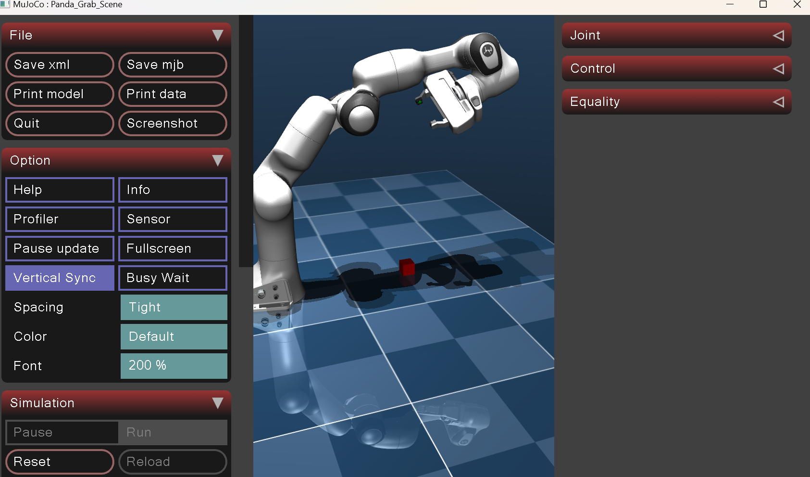
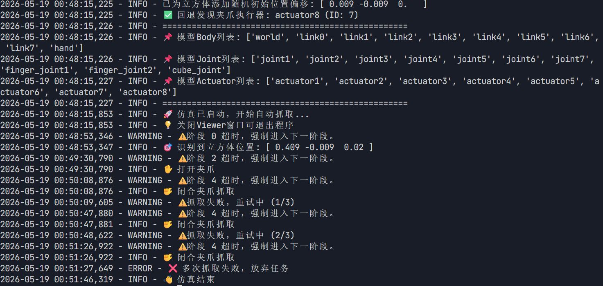

# Franka Panda 机械臂自动抓取仿真项目
## 一、项目概述
本项目基于MuJoCo 高精度物理仿真引擎与 Python 语言开发，实现 Franka Panda 自由度协作机械臂全自动抓取搬运仿真系统，是基础抓取程序的全面优化升级版本。

系统依托运动学逆解、雅可比伪逆算法、PD 力矩闭环控制与分段状态机逻辑，完成目标立方体定位、精准抓取、稳定抬升、定点放置、机械臂自动复位全流程无人化作业。同时加入目标位置随机扰动、抓取接触校验、失败自动重试、运动姿态约束、阶段超时防护等增强功能，大幅提升仿真系统鲁棒性与实际工程贴合度，可用于机器人运动控制算法验证、机械臂抓取策略调试、高校机器人课程实训、工业抓取场景预仿真等场景。

项目摒弃基础版本仅位置控制、姿态偏移、抓取易脱落、程序易卡死等缺陷，实现末端执行器6 自由度位姿同步控制，运动平稳无抖动，抓取成功率高，代码模块化程度高，便于二次开发与算法迭代。

## 二、开发环境与技术栈
### 1 技术栈
- Python 3.8+
- MuJoCo 2.3.0+
- NumPy
- 面向对象模块化设计
### 2. 运行环境
- 操作系统：Windows / Linux / Ubuntu
- Python 版本：3.8 ~ 3.10
- 仿真引擎：MuJoCo 2.3 及以上

### 3. 核心依赖库
```bash
pip install numpy mujoco
```

### 4. 核心技术
- 运动学：雅可比矩阵、雅可比伪逆逆运动学求解
- 控制算法：关节空间 PD 力矩控制、笛卡尔空间自适应速度控制
- 流程管理：有限状态机分段任务调度
- 感知校验：MuJoCo 物理接触碰撞检测
- 仿真建模：MJCF 机器人场景建模

## 三、整体系统架构
项目采用面向对象编程设计，以`PandaAutoGrab`为主控制类，整体划分为六大功能模块，模块间低耦合高内聚：

- **模型加载与异常处理模块**：自动匹配 XML 场景路径，捕获模型缺失、语法错误等异常，初始化机械臂关节、夹爪、末端执行器参数
- **场景随机扰动模块**：仿真启动时自动给立方体添加 XY 方向随机位置偏移，模拟真实场景目标摆放偏差，测试算法容错能力
- **运动控制核心模块**：包含末端 6D 位姿控制、自适应速度调节、PD 力矩输出三大子功能
- **夹爪驱动控制模块**：自动识别夹爪执行器，自适应控制开合力度与开合幅度，匹配不同模型控制量程
- **状态机任务调度模块**：拆分完整抓取流程为多段独立状态，有序执行所有动作逻辑
- **仿真可视化与日志模块**：固定最优观测相机视角，全程日志记录运行状态，方便调试分析

## 四、核心优化升级点
### 1. 支持 6D 全维度位姿控制
优化内容：基础版仅实现 XYZ 位置移动，优化版新增姿态四元数约束，保证夹爪始终竖直向下抓取，杜绝倾斜掉落。
```python
# _move_step函数中新增姿态误差计算与6D雅可比拼接
ori_err = np.zeros(3)
if target_quat is not None:
    ee_quat = self.data.xquat[self.ee_body_id]
    mujoco.mju_subQuat(ori_err, target_quat, ee_quat)

# 6D位姿控制：拼接位置+姿态雅可比矩阵
jacobian = np.vstack([jp, jr])
task_err = np.concatenate([pos_err, ori_err])
```

### 2. 抓取成功智能校验
优化内容：通过遍历仿真物理接触对，判断夹爪与立方体是否有效贴合，实现抓取结果自动判定。
```python
# PHASE_VERIFY_GRASP阶段接触检测
for i in range(self.data.ncon):
    contact = self.data.contact[i]
    body1 = self.model.body(self.model.geom_bodyid[contact.geom1]).name
    body2 = self.model.body(self.model.geom_bodyid[contact.geom2]).name
    if ("finger" in body1 and "cube" in body2) or ("finger" in body2 and "cube" in body1):
        has_contact = True
        break
```

### 3. 抓取失败自动重试机制
优化内容：连续抓取失败后自动复位重试，设置最大重试次数，避免任务卡死。
```python
# 抓取失败重试逻辑
self.grasp_retries += 1
if self.grasp_retries < self.max_grasp_retries:
    self.current_phase = self.PHASE_OPEN_GRIPPER
else:
    self.current_phase = self.PHASE_MOVE_BACK_TO_INIT
```

### 4. 阶段运行超时保护
优化内容：每个动作阶段设置最大运行步数，长时间未到达目标自动跳转下一流程，提升程序稳定性。
```python
# 状态机中全局超时判断
if hasattr(self, '_phase_start_step') and (self.step_counter - self._phase_start_step) > self.max_steps_per_phase:
    logging.warning(f"⚠️ 阶段 {self.current_phase} 超时，强制进入下一阶段。")
    self._advance_phase()
```

### 5. 自适应平滑调速
优化内容：末端距离目标越近运动速度越慢，有效消除运动过冲、关节抖动问题。
```python
# 自适应速度计算
adaptive_speed = speed * min(1.0, dist / 0.05)
joint_vel_cmd = adaptive_speed * jacobian_pinv @ task_err
```

### 6. 精准抓取高度自适应
优化内容：根据机械臂手爪实际尺寸计算最优抓取高度，避免抓空、挤压碰撞物体。
```python
# 自适应抓取高度计算
grab_target_z = self.cube_pos[2] + self.grab_height
target = np.array([self.cube_pos[0], self.cube_pos[1], grab_target_z])
```

### 7. 增强型 PD 力矩参数
优化内容：优化比例、微分增益与关节力矩上限，提升机械臂负重能力，抬升重物更加稳定。
```python
# 优化后的PD控制器参数
self.PD_KP = 300
self.PD_KD = 80
self.TORQUE_LIMIT = 40
```

### 8. 通用型夹爪自适应驱动
优化内容：自动遍历识别所有夹爪执行器，无需手动修改硬件 ID，适配多种 Panda 机械臂 XML 模型。
```python
# 自动扫描夹爪执行器
for i in range(self.model.nu):
    act_name = self.model.actuator(i).name
    if 'finger' in act_name.lower() or 'gripper' in act_name.lower():
        self.gripper_actuator_ids.append(i)
```

# 五、核心控制原理

### 1. 阻尼最小二乘法逆运动学求解

本项目采用**阻尼最小二乘法（Damped Least Squares, DLS）**求解逆运动学，避免雅可比矩阵奇异，实现末端6D位姿的平滑控制。

首先，通过MuJoCo内置接口求解末端的位置雅可比矩阵 $\boldsymbol{J}_p$ 与姿态雅可比矩阵 $\boldsymbol{J}_r$，拼接得到6维任务空间雅可比矩阵：

$$\boldsymbol{J} = [\boldsymbol{J}_p \ ; \ \boldsymbol{J}_r] \in \mathbb{R}^{6 \times 7}$$

为避免矩阵奇异，引入阻尼系数 $\lambda$ 求解雅可比伪逆：

$$\boldsymbol{J}^\dagger = \boldsymbol{J}^T (\boldsymbol{J}\boldsymbol{J}^T + \lambda^2 \boldsymbol{I})^{-1}$$

最后，将末端笛卡尔空间位姿误差 $\boldsymbol{e}$ 转换为关节速度指令：

$$\boldsymbol{\dot{q}} = k_v \cdot \boldsymbol{J}^\dagger \cdot \boldsymbol{e}$$

其中：
- $\boldsymbol{J}^\dagger$ 为阻尼伪逆矩阵
- $\lambda$ 为阻尼系数
- $\boldsymbol{I}$ 为单位矩阵
- $k_v$ 为自适应速度系数，距离目标越近系数越小，可有效防止过冲与抖动。

**对应核心代码：**
```python
def _move_step(self, target_pos, target_quat=None, speed=0.3):
    # 计算位置与姿态误差
    pos_err = target_pos - self.get_ee_pos()
    ori_err = np.zeros(3)
    if target_quat is not None:
        mujoco.mju_subQuat(ori_err, target_quat, self.data.xquat[self.ee_body_id])
    
    # 计算6D雅可比矩阵
    jp, jr = self._compute_jacobian()
    jacobian = np.vstack([jp, jr])
    task_err = np.concatenate([pos_err, ori_err])
  
    # 阻尼伪逆求解
    lambda_ = self.JACOBIAN_DAMPING
    jacobian_pinv = jacobian.T @ np.linalg.inv(jacobian @ jacobian.T + lambda_**2 * np.eye(6))
    
    # 自适应速度控制
    dist = np.linalg.norm(pos_err)
    adaptive_speed = speed * min(1.0, dist / 0.05)
    joint_vel_cmd = adaptive_speed * jacobian_pinv @ task_err
    return joint_vel_cmd
```
---
### 2. PD 闭环力矩控制

在关节空间使用 PD 控制器，将关节速度指令转换为力矩输出，确保机械臂运动平稳且具备足够的负载能力。控制器公式为：

$$\tau = K_p \cdot \Delta q - K_d \cdot \dot{q}$$

其中：
- $\tau$：关节输出力矩
- $K_p$：比例增益，项目中取 $K_p=300$
- $K_d$：微分增益，项目中取 $K_d=80$
- $\Delta q$：关节角度偏差
- $\dot{q}$：关节实际速度

为保证输出安全，同时对力矩进行限幅处理：

$$\tau \in [-\tau_{lim}, \tau_{lim}], \quad \tau_{lim}=40$$

**对应核心代码：**
```python
dt = self.model.opt.timestep
for i in range(7):
    angle_error = joint_vel_cmd[i] * dt
    torque = self.PD_KP * angle_error - self.PD_KD * self.data.qvel[self.joint_ids[i]]
    torque = np.clip(torque, -self.TORQUE_LIMIT, self.TORQUE_LIMIT)
    self.data.ctrl[self.arm_actuator_ids[i]] = torque
```
---
### 3. 夹爪控制逻辑

项目区分夹爪全开、全闭两种工作状态，通过设置固定延时步数（200 步）保证机械结构动作完全完成。同时，为适配不同模型，自动读取执行器控制范围，对控制指令做限幅处理：

$$u_{gripper} = \text{clip}(u_{cmd}, u_{min}, u_{max})$$

其中：
- $u_{cmd}$：夹爪控制指令
- $u_{min}$：执行器最小控制量程
- $u_{max}$：执行器最大控制量程

**对应核心代码：**
```python
def _gripper_step(self, pos: float) -> None:
    if self.gripper_actuator_ids:
        for actuator_id in self.gripper_actuator_ids:
            ctrlrange = self.model.actuator_ctrlrange[actuator_id]
            final_ctrl = np.clip(pos, ctrlrange[0], ctrlrange[1])
            self.data.ctrl[actuator_id] = final_ctrl
```
---


## 六、项目运行结果
以下是仿真运行结果：



## 七、项目功能特点
- 全自动化作业：无需人工遥控点位，自主完成定位 - 抓取 - 搬运 - 放置 - 复位全流程
- 高容错鲁棒性：支持目标小幅位置偏移、抓取失败重试、动作超时自动跳转
- 运动控制高精度：毫米级末端定位精度，运动轨迹平滑流畅
- 可视化直观调试：内置固定最优观测视角，清晰观测每一步执行动作
- 日志全程记录：实时打印任务节点、位置信息、异常警告，方便算法调试
- 通用性强：代码逻辑通用，可快速适配同类型串联多自由度机械臂

## 八、项目总结
本优化版 Franka Panda 机械臂自动抓取仿真系统，基于成熟的机器人运动学与闭环控制理论开发，解决了传统简易抓取程序运动不稳定、容错性差、功能单一等痛点。

系统架构清晰、控制逻辑严谨、运行稳定可靠，既适合初学者学习机械臂逆运动学、状态机调度、PD 控制等核心知识，也可作为机器人抓取算法研发的标准仿真实验平台，具备极高的学习价值与工程实用价值。