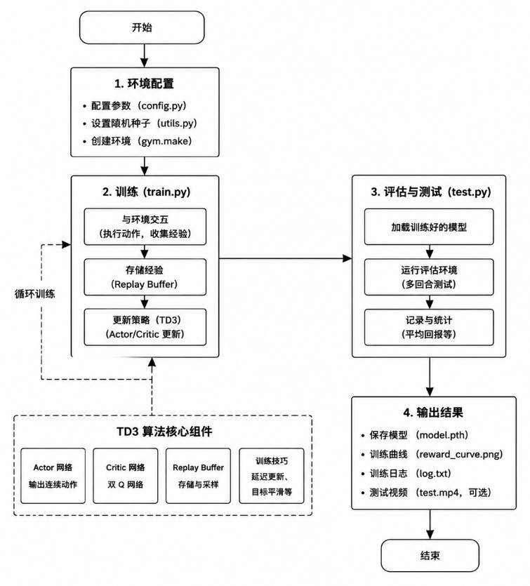
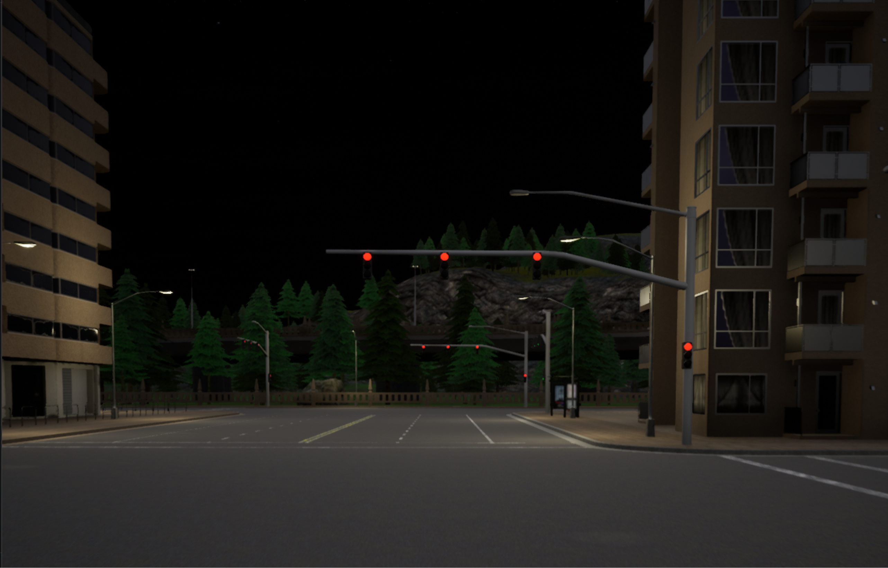

# 基于 TD3 + CNN 的强化学习自动驾驶系统

本项目使用 TD3（Twin Delayed Deep Deterministic Policy Gradient）算法训练自动驾驶智能体，支持两类仿真环境：

1. **Gymnasium CarRacing-v3**：轻量级二维赛车环境，适合快速验证 TD3 + CNN 视觉控制流程；
2. **Carla 模拟器**：面向自动驾驶研究的三维高保真仿真环境，支持车辆传感器、地图、碰撞检测、车道入侵检测和多天气场景。

项目代码采用模块化结构，将环境封装、视觉预处理、帧堆叠、动作平滑、奖励塑造、TD3 智能体、Actor/Critic 网络和训练入口拆分为独立文件，便于后续扩展到更复杂的自动驾驶任务。

---

## 1 项目背景与研究动机

### 1.1 行业发展现状

随着智能驾驶技术的发展，高维连续动作空间下的车辆控制策略优化成为核心问题。传统基于规则的方法在复杂环境下适应性不足，难以应对多变的道路场景和实时决策需求。因此，本项目旨在通过强化学习框架，构建一个可在仿真环境下自动学习驾驶策略的实验平台，为后续车辆自主决策、车路协同、多传感器融合等研究提供基础支持。

### 1.2 研究动机与目标

强化学习（RL）凭借“试错—反馈—优化”的自主学习特性，适合解决连续动作空间控制问题。本项目以 `CarRacing-v3` 和 `Carla` 为实验环境，构建基于 TD3 + CNN 的自动驾驶强化学习系统，核心目标包括：

- 实现从视觉输入到连续动作输出的端到端驾驶控制；
- 使用 TD3 的双 Critic、目标策略平滑、延迟策略更新和软更新机制提升训练稳定性；
- 将轻量级 CarRacing 环境中的训练流程迁移到 Carla 中，验证环境接口抽象和算法模块的复用性；
- 为后续真实车辆低层级控制、多场景测试、多智能体交互和车路协同研究提供可扩展框架。

---

## 2 项目代码结构

```text
src/td3_carracing/
├── README.md
├── requirements.txt
├── main.py                         # Gymnasium CarRacing-v3 训练入口
├── env_wrappers.py                 # CarRacing 环境封装：跳帧、图像预处理、帧堆叠、动作平滑、奖励塑造
├── td3_agent.py                    # CarRacing 版本 TD3 智能体与经验回放
├── td3_models.py                   # CarRacing 版本 Actor / Critic 网络
├── run.png
└── carla/
    ├── README.md
    ├── __init__.py
    ├── main.py                     # Carla 训练 / 测试入口
    ├── carla_env.py                # Carla Gym 风格环境适配器
    ├── env_wrappers.py             # Carla 环境封装：跳帧、预处理、帧堆叠、动作平滑、奖励塑造
    ├── td3_agent.py                # Carla 版本 TD3 智能体与经验回放
    ├── td3_models.py               # Carla 版本 Actor / Critic 网络
    └── weather_examples.py         # Carla 天气示例
```

---

## 3 整体技术架构

系统采用“环境接口层—智能体层—训练与推理层—评估与扩展层”的分层设计。

| 层级 | 核心功能 | 对应代码 |
|---|---|---|
| 环境接口层 | 将 Gymnasium / Carla 环境统一为 `reset()`、`step(action)`、`observation_space`、`action_space` 接口 | [env_wrappers.py](../../src/td3_carracing/env_wrappers.py)、[carla/carla_env.py](../../src/td3_carracing/carla/carla_env.py)、[carla/env_wrappers.py](../../src/td3_carracing/carla/env_wrappers.py) |
| 智能体层 | 策略生成、价值评估、经验回放、目标网络更新 | [td3_agent.py](../../src/td3_carracing/td3_agent.py)、[carla/td3_agent.py](../../src/td3_carracing/carla/td3_agent.py) |
| 网络模型层 | CNN 图像编码、Actor 连续动作输出、双 Critic Q 值估计 | [td3_models.py](../../src/td3_carracing/td3_models.py)、[carla/td3_models.py](../../src/td3_carracing/carla/td3_models.py) |
| 训练与推理层 | episode 循环、探索噪声、模型保存 / 加载、训练和测试切换 | [main.py](../../src/td3_carracing/main.py)、[carla/main.py](../../src/td3_carracing/carla/main.py) |
| 扩展层 | Carla 地图、天气、传感器、碰撞和车道入侵信息扩展 | [carla/carla_env.py](../../src/td3_carracing/carla/carla_env.py)、[carla/weather_examples.py](../../src/td3_carracing/carla/weather_examples.py) |

项目整体执行流程如下：
<p float="left">
   
</p>

---

## 4 核心理论基础

### 4.1 TD3 算法核心原理

TD3 是 DDPG 的改进版本，主要用于连续动作空间控制任务。项目中的 TD3 智能体主要包括以下机制：

- **双 Critic 网络**：分别估计 `Q1(s,a)` 和 `Q2(s,a)`，训练目标取较小值，缓解 Q 值过估计问题；
- **延迟 Actor 更新**：Critic 更新更频繁，Actor 每隔若干次 Critic 更新后再更新，降低策略震荡；
- **目标策略平滑**：计算目标动作时加入裁剪后的噪声，提升策略对动作扰动的鲁棒性；
- **目标网络软更新**：使用 `tau` 对 Actor / Critic 的目标网络进行指数滑动更新。

实现位置：

- CarRacing 版本 TD3 训练逻辑：[td3_agent.py](../../src/td3_carracing/td3_agent.py)
- Carla 版本 TD3 训练逻辑：[carla/td3_agent.py](../../src/td3_carracing/carla/td3_agent.py)

### 4.2 CNN 视觉状态特征提取

原始环境观测为图像输入。项目先通过环境封装完成灰度化、缩放、归一化和帧堆叠，再送入 Actor / Critic 中的 CNN 编码器提取视觉特征。

实现位置：

- CarRacing 图像预处理与帧堆叠：[env_wrappers.py](../../src/td3_carracing/env_wrappers.py)
- Carla 图像预处理与帧堆叠：[carla/env_wrappers.py](../../src/td3_carracing/carla/env_wrappers.py)
- Actor / Critic CNN 网络：[td3_models.py](../../src/td3_carracing/td3_models.py)、[carla/td3_models.py](../../src/td3_carracing/carla/td3_models.py)

### 4.3 经验回放机制

当前代码使用环形经验回放缓冲区存储 `(state, action, reward, next_state, done)`，训练时从缓冲区随机采样 batch，以降低样本相关性、提升数据利用率。

实现位置：

- CarRacing 经验回放：[td3_agent.py](../../src/td3_carracing/td3_agent.py)
- Carla 经验回放：[carla/td3_agent.py](../../src/td3_carracing/carla/td3_agent.py)

> 说明：当前代码实现的是普通随机经验回放，不是优先级经验回放（PER）。如需加入 PER，可在 `ReplayBuffer` 中增加 priority、importance sampling weight 和 TD error 更新逻辑。

### 4.4 奖励工程

项目在原始环境奖励基础上增加奖励塑造，用于鼓励平稳驾驶、速度控制和减少异常动作。

CarRacing 版本中，奖励塑造结合速度、转向幅度、转向抖动、赛道 / 草地区域检测等信息；Carla 版本中，奖励塑造结合速度、碰撞、车道入侵、连续大转角、方向盘抖动等信息。

实现位置：

- CarRacing 奖励塑造：[env_wrappers.py](../../src/td3_carracing/env_wrappers.py)
- Carla 奖励塑造：[carla/env_wrappers.py](../../src/td3_carracing/carla/env_wrappers.py)
- Carla 基础奖励、碰撞和车道入侵信息：[carla/carla_env.py](../../src/td3_carracing/carla/carla_env.py)

---

## 5 具体实现说明

### 5.1 Gymnasium CarRacing-v3 训练流程

CarRacing 训练入口位于 [main.py](../../src/td3_carracing/main.py)，主要流程如下：

1. 使用 `gym.make("CarRacing-v3", render_mode="human")` 创建环境；
2. 调用 [wrap_env](../../src/td3_carracing/env_wrappers.py) 完成跳帧、灰度化、缩放、归一化、帧堆叠、动作平滑和奖励塑造；
3. 根据环境的 `observation_space` 和 `action_space` 初始化 [TD3Agent](../../src/td3_carracing/td3_agent.py)；
4. 训练循环中使用 `agent.select_action(state, smooth=True)` 生成动作，并叠加分通道探索噪声；
5. 将交互样本写入 `ReplayBuffer`，调用 `agent.train()` 更新 Critic 和 Actor；
6. 每当产生更高 episode reward 时保存最佳模型，每 100 个 episode 保存一次阶段模型。

### 5.2 CarRacing 环境封装

CarRacing 环境封装位于 [env_wrappers.py](../../src/td3_carracing/env_wrappers.py)，包括：

- `SkipFrame`：重复执行同一个动作并累计奖励，提高训练效率；
- `PreProcessObs`：RGB 图像转灰度、缩放到 `84x84`、归一化到 `[0,1]`；
- `StackFrames`：堆叠连续 4 帧，并调整为 CNN 输入格式；
- `SmoothActionWrapper`：对连续动作做指数平滑，限制相邻时刻方向盘变化；
- `TrackDetectionWrapper`：根据图像底部区域的颜色比例估计车辆是否在赛道 / 草地上；
- `RewardShapingWrapper`：综合速度、转向、赛道检测和动作平滑性调整奖励。

### 5.3 TD3 智能体

TD3 智能体实现位于 [td3_agent.py](../../src/td3_carracing/td3_agent.py) 和 [carla/td3_agent.py](../../src/td3_carracing/carla/td3_agent.py)，包含：

- `ReplayBuffer`：环形缓冲区，存储交互样本并随机采样 batch；
- `select_action()`：使用 Actor 输出连续动作，并对方向盘、油门、刹车做范围裁剪；
- `train()`：计算目标 Q 值、更新双 Critic、延迟更新 Actor、软更新目标网络；
- `save()` / `load()`：分别保存和加载 Actor、Critic1、Critic2 参数。

### 5.4 Actor / Critic 网络

Actor / Critic 网络定义位于 [td3_models.py](../../src/td3_carracing/td3_models.py) 和 [carla/td3_models.py](../../src/td3_carracing/carla/td3_models.py)。

- **Actor**：输入堆叠后的图像状态，经 CNN 提取特征后输出连续动作 `[steer, throttle, brake]`；
- **Critic**：输入状态特征和动作向量，输出 Q 值；
- **双 Critic 结构**：TD3 训练时使用两个 Critic 网络降低过估计风险。

### 5.5 适配到 Carla 模拟器

Carla 适配代码位于 [src/td3_carracing/carla/](../../src/td3_carracing/carla/)，其中核心是 [carla_env.py](../../src/td3_carracing/carla/carla_env.py)。该文件将 Carla 封装成类似 Gymnasium 的环境，使 TD3 训练代码可以复用 `reset()`、`step(action)`、`action_space`、`observation_space` 等接口。

Carla 适配内容包括：

1. **连接 Carla Server**  
   `CarlaEnv` 通过 `carla.Client('localhost', 2000)` 连接本地 Carla 服务，并设置超时时间。

2. **地图与车辆初始化**  
   默认使用 `Town03`，通过 Carla blueprint 生成 `vehicle.tesla.model3`，并关闭 autopilot，由 TD3 智能体控制车辆。

3. **动作空间映射**  
   Carla 版本动作空间为三维连续控制量：

   | 动作 | 范围 | 含义 |
   |---|---:|---|
   | `steer` | `[-1.0, 1.0]` | 方向盘转角，负数向左，正数向右 |
   | `throttle` | `[0.0, 1.0]` | 油门 |
   | `brake` | `[0.0, 1.0]` | 刹车 |

   在 [carla_env.py](../../src/td3_carracing/carla/carla_env.py) 的 `step(action)` 中，动作会被转换为 `carla.VehicleControl` 并作用到车辆上。

4. **观察空间适配**  
   Carla 车辆挂载 RGB 摄像头，图像尺寸先由传感器采集，再在 `process_image()` 中缩放到 `84x84`。随后通过 [carla/env_wrappers.py](../../src/td3_carracing/carla/env_wrappers.py) 转为灰度图并堆叠 4 帧，作为 CNN 输入。

5. **传感器接入**  
   Carla 环境接入了：

   - RGB 摄像头：提供视觉状态；
   - 碰撞传感器：用于终止 episode 和奖励惩罚；
   - 车道入侵传感器：用于判断是否压线 / 偏离车道并施加惩罚。

6. **奖励函数适配**  
   Carla 基础奖励位于 [carla_env.py](../../src/td3_carracing/carla/carla_env.py)，综合速度奖励、碰撞惩罚、车道入侵惩罚和每步基础奖励。进一步的奖励塑造位于 [carla/env_wrappers.py](../../src/td3_carracing/carla/env_wrappers.py)，包括方向盘大转角惩罚、抖动惩罚、高速平稳驾驶奖励和低速惩罚。

7. **天气与场景扩展**  
   Carla 版本支持 `clear`、`rainy`、`foggy`、`cloudy`、`wet`、`random` 等天气模式，可通过 [carla/main.py](../../src/td3_carracing/carla/main.py) 的命令行参数传入，也可参考 [carla/weather_examples.py](../../src/td3_carracing/carla/weather_examples.py) 扩展天气测试。

8. **训练 / 测试自动切换**  
   [carla/main.py](../../src/td3_carracing/carla/main.py) 会检测 `models/td3_carla_best_actor.pth` 和 `models/td3_carla_best_critic1.pth` 是否存在：如果存在则进入测试模式，否则进入训练模式。

---

## 6 超参数与训练配置

### 6.1 CarRacing-v3 默认配置

| 参数 | 当前代码默认值 | 说明 |
|---|---:|---|
| `max_episodes` | 2500 | 最大训练回合数 |
| `max_timesteps` | 1200 | 每回合最大步数 |
| `warmup_episodes` | 80 | 预热回合数 |
| `expl_noise_steer` | 0.12 | 初始转向探索噪声 |
| `expl_noise_throttle` | 0.12 | 初始油门探索噪声 |
| `expl_noise_brake` | 0.05 | 初始刹车探索噪声 |
| 模型保存间隔 | 100 episodes | 阶段性保存模型 |
| 最佳模型路径 | `models/td3_car_best_*` | 保存最高奖励模型 |

配置位置：[main.py](../../src/td3_carracing/main.py)

### 6.2 Carla 默认配置

| 参数 | 当前代码默认值 | 说明 |
|---|---:|---|
| `town` | `Town03` | Carla 地图 |
| `weather` | `clear` | 天气模式 |
| `max_episodes` | 2000 | 最大训练回合数 |
| `max_timesteps` | 1000 | 每回合最大步数 |
| `warmup_episodes` | 50 | 预热回合数 |
| `expl_noise_steer` | 0.1 | 初始转向探索噪声 |
| `expl_noise_throttle` | 0.15 | 初始油门探索噪声 |
| `expl_noise_brake` | 0.08 | 初始刹车探索噪声 |
| 最佳模型路径 | `models/td3_carla_best_*` | 保存最高奖励模型 |

配置位置：[carla/main.py](../../src/td3_carracing/carla/main.py)

---

## 7 运行环境与部署步骤

### 7.1 CarRacing-v3 环境依赖

```bash
pip install -r requirements.txt
```

主要依赖包括：

- Python 3.8+
- PyTorch
- Gymnasium / Box2D
- OpenCV-Python
- NumPy

依赖文件：[requirements.txt](../../src/td3_carracing/requirements.txt)

### 7.2 运行 CarRacing-v3 训练

```bash
cd src/td3_carracing
python main.py
```

训练过程中会使用 `render_mode="human"` 显示游戏窗口，并自动在 `models/` 目录下保存模型。

### 7.3 Carla 环境依赖

运行 Carla 版本前，需要先安装 Carla 模拟器和 Carla Python API。

```bash
# 安装基础 Python 依赖
pip install torch numpy opencv-python gymnasium

# 安装 Carla Python API，文件位于 Carla 安装目录中
pip install PythonAPI/carla/dist/carla-<version>-py3-none-any.whl
```

### 7.4 启动 Carla Server

Linux：

```bash
./CarlaUE4.sh
```

Windows：

```bash
CarlaUE4.exe
```

### 7.5 运行 Carla 训练 / 测试

```bash
cd src/td3_carracing/carla
python main.py
```

指定地图和天气：

```bash
python main.py --town Town03 --weather clear
python main.py --town Town05 --weather rainy
python main.py --town Town03 --weather random
```

如果 `models/td3_carla_best_actor.pth` 和相关 Critic 模型存在，程序会自动进入测试模式；否则进入训练模式。

---

## 8 功能效果与运行说明

### 8.1 CarRacing-v3 模式

- 输入：`84x84` 灰度图，连续 4 帧堆叠；
- 输出：连续动作 `[steer, throttle, brake]`；
- 训练：每步与环境交互、写入经验回放、更新 TD3 网络；
- 保存：最佳模型和每 100 回合 checkpoint；
- 适合用途：快速调试 TD3、奖励函数、动作平滑和图像预处理流程。
- 运行效果：
    <p float="left">
      
      
    </p>

### 8.2 Carla 模式

- 输入：车载 RGB 摄像头图像，经预处理后作为 CNN 输入；
- 输出：Carla `VehicleControl` 中的方向盘、油门、刹车；
- 传感器：RGB camera、collision sensor、lane invasion sensor；
- 场景：支持地图和天气切换；
- 适合用途：更接近真实自动驾驶任务的仿真验证。
- 运行效果：
    <p float="left">
      
    </p>

### 8.3 常见问题与解决

| 问题现象 | 可能原因 | 解决方法 |
|---|---|---|
| `CarRacing-v3` 无法创建 | Box2D 未安装 | 使用 `pip install "gymnasium[box2d]"` 或安装项目 `requirements.txt` |
| 训练窗口无法显示 | 无图形界面或 SDL 问题 | 可在服务器环境中启用虚拟显示，或修改 `main.py` 中的 SDL 配置 |
| Carla 连接失败 | Carla Server 未启动或端口不对 | 先启动 `CarlaUE4.sh` / `CarlaUE4.exe`，确认端口为 `2000` |
| Carla Python API 导入失败 | 未安装 Carla wheel | 安装 `PythonAPI/carla/dist/carla-<version>-py3-none-any.whl` |
| Carla 训练速度慢 | 高保真仿真消耗大 | 降低画面质量、减少渲染、缩短 episode、使用 GPU |
| 车辆频繁碰撞或打转 | 奖励函数、噪声或动作平滑参数不合适 | 调整 [carla/env_wrappers.py](../../src/td3_carracing/carla/env_wrappers.py) 和 [carla/main.py](../../src/td3_carracing/carla/main.py) 中的奖励权重与噪声参数 |

---

## 9 后续拓展方向

1. **算法扩展**
   - 集成 SAC、PPO、DrQ-v2 等算法，与 TD3 进行对比；
   - 在 CNN 中加入注意力机制或更强视觉 backbone；
   - 将普通经验回放升级为优先级经验回放（PER）。

2. **Carla 场景扩展**
   - 增加多地图、多天气、多交通流训练；
   - 引入红绿灯、行人、动态车辆等复杂交通要素；
   - 使用 Carla 同步模式提升传感器和仿真步进的一致性。

3. **多模态传感器融合**
   - 接入激光雷达、深度相机、IMU、GNSS、速度等信息；
   - 设计视觉 + 数值状态的多模态融合网络。

4. **安全与可解释性**
   - 加入动作安全约束，如最大转角变化率、最小制动距离；
   - 使用可视化方法分析 CNN 关注区域和策略决策依据。

5. **部署优化**
   - 模型量化、剪枝和 TensorRT 加速；
   - 适配 NVIDIA Jetson 等边缘计算设备。
