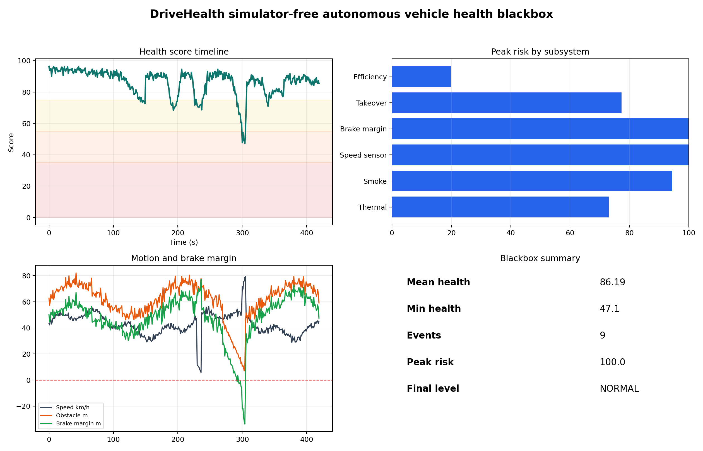
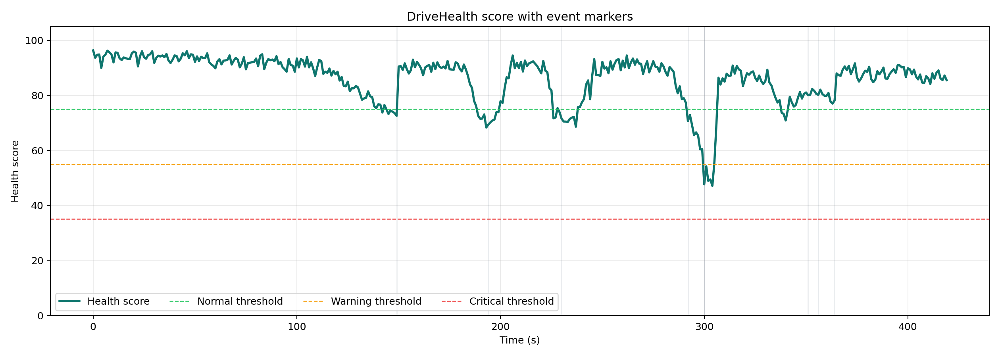
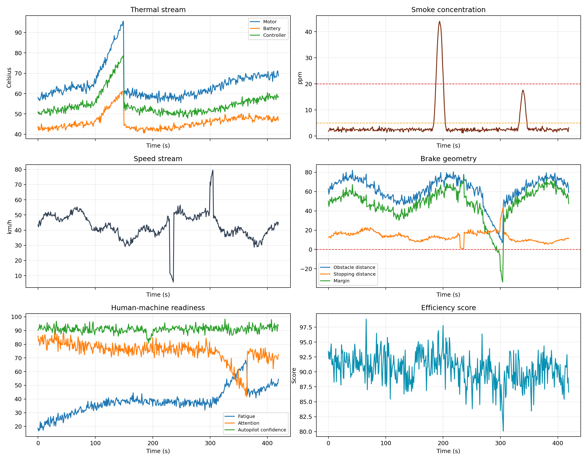
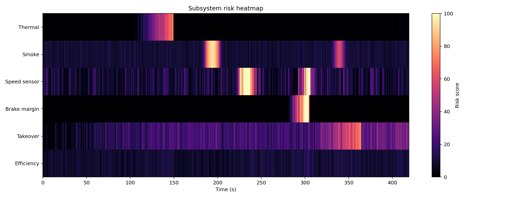
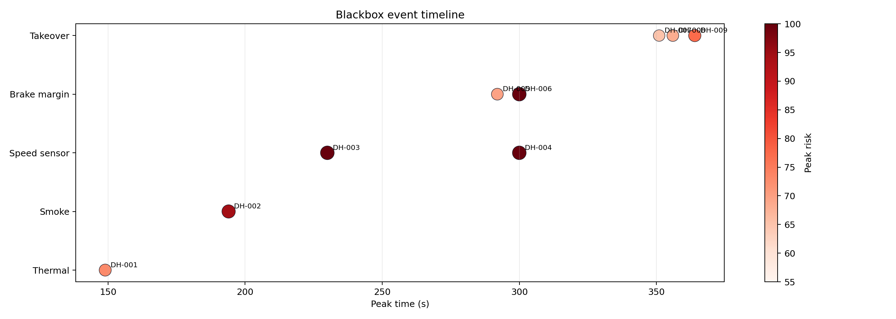
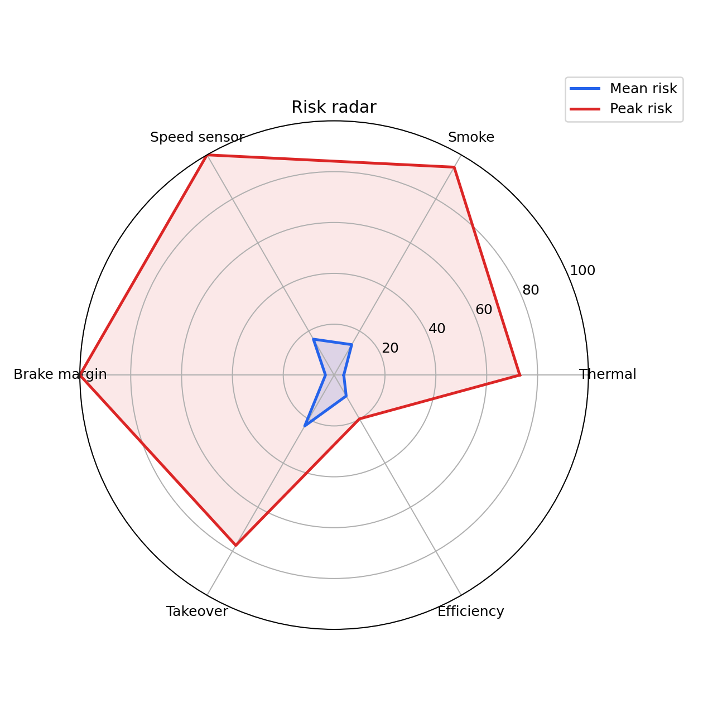
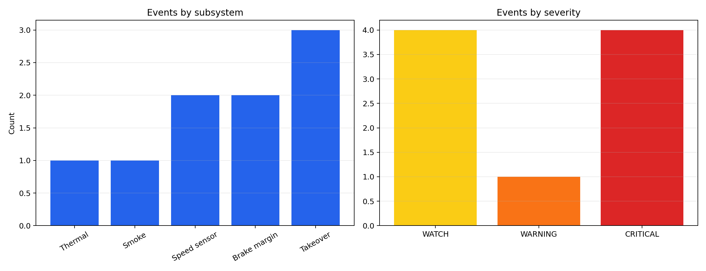
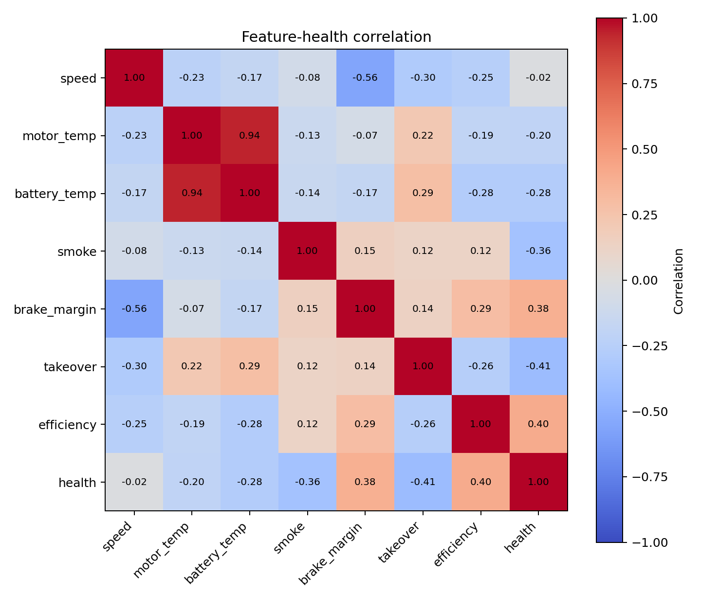
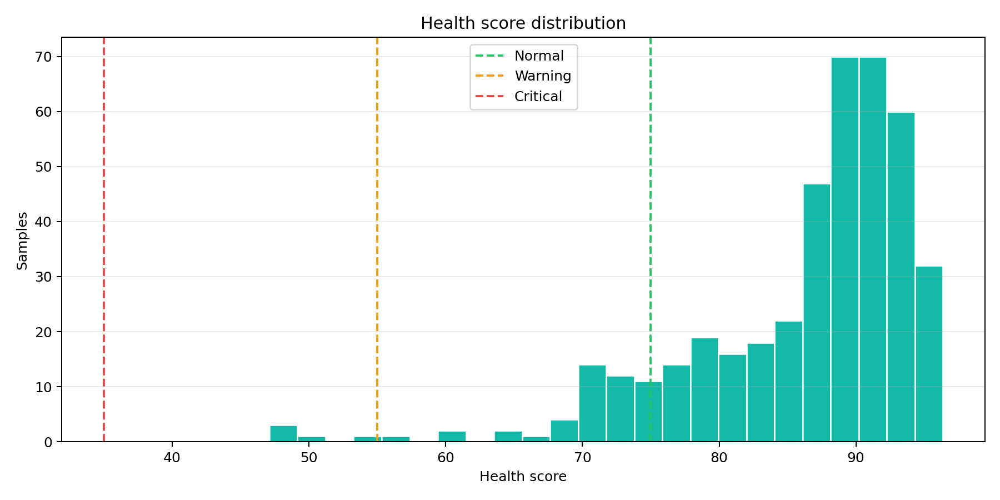
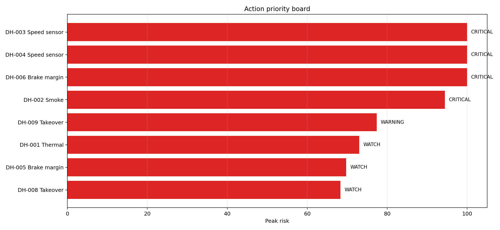

# DriveHealth：面向无人车运行安全的多源异常诊断与自健康黑匣子系统

## 1. 项目摘要

DriveHealth 是一个不依赖 CARLA、AirSim、MuJoCo 或 Gazebo 的无人车运行安全监测系统。项目面向无人车运行过程中可能出现的内部故障和安全退化问题，融合温度、烟雾、速度、制动安全裕度、人机接管状态和运行效率等多源数据，输出车辆健康分数、子系统风险、黑匣子事件记录和可视化复盘报告。

本项目的核心目标不是在三维模拟器中测试车辆如何开车，而是回答一个更偏运行安全的问题：

**当无人车已经在运行时，系统如何及时发现自身状态异常，并留下可复盘的黑匣子证据？**

## 2. 项目特点

- **无需模拟器**：不需要启动 CARLA、AirSim、MuJoCo 或 Gazebo。
- **多源健康诊断**：同时分析热管理、烟雾、电控/速度、制动、人机接管和效率风险。
- **黑匣子事件提取**：自动记录高风险事件的起止时间、峰值风险、严重等级和建议动作。
- **可解释风险评分**：每个风险都有对应传感器依据，不是单纯输出一个黑盒分类结果。
- **报告可视化完整**：自动生成 CSV、JSON、HTML 和 10 张 PNG 图表，适合课堂演示和项目答辩。

## 3. 系统运行方式

运行入口：

```bash
python src/unmanned_vehicle_safety_and_operation/drivehealth_blackbox.py
```

可选参数：

```bash
python src/unmanned_vehicle_safety_and_operation/drivehealth_blackbox.py --duration 600 --event-threshold 60
```

默认输出目录：

```text
src/unmanned_vehicle_safety_and_operation/drivehealth_visualizations/
```

## 4. 数据来源说明

本次演示使用合成传感器流，采样频率为 1 Hz，总时长为 420 秒，共生成 420 条黑匣子日志。合成数据用于模拟真实无人车运行日志中的典型状态变化，包括：

| 数据类型 | 含义 | 风险场景 |
|---|---|---|
| 电机/电池/控制器温度 | 关键部件热状态 | 过热、散热失效 |
| 烟雾浓度 | 车内或电气舱烟雾风险 | 短路、燃烧、烟雾扩散 |
| 速度 | 车辆运动状态 | 速度突变、传感器跳变 |
| 障碍物距离和路面摩擦 | 制动安全裕度 | 距离不足、湿滑路面 |
| 驾驶员疲劳/注意力 | 人机共驾接管能力 | 接管时间过长 |
| 效率分数 | 路径、能耗和驾驶平顺性 | 运行效率退化 |

后续可以将合成数据替换为真实 CSV 运行日志或硬件传感器数据。

## 5. 技术路线

```text
多源传感器流
  ├── 温度 / 烟雾 / 速度
  ├── 障碍物距离 / 路面摩擦
  ├── 驾驶员状态 / 自动驾驶置信度
  └── 能耗 / 路径偏差 / 效率
        ↓
子系统风险评分
  ├── thermal_risk
  ├── smoke_risk
  ├── speed_risk
  ├── brake_risk
  ├── takeover_risk
  └── efficiency_risk
        ↓
加权融合健康分数
        ↓
黑匣子事件提取
        ↓
CSV / JSON / HTML / PNG 可视化报告
```

## 6. 核心指标结果

| 指标 | 结果 |
|---|---:|
| 运行时长 | 420 s |
| 采样频率 | 1 Hz |
| 日志样本数 | 420 条 |
| 平均健康分 | 86.19 |
| 最低健康分 | 47.10 |
| 最终健康分 | 85.55 |
| 最终状态 | NORMAL |
| 黑匣子事件数 | 9 |
| 峰值风险子系统 | Speed sensor |
| 峰值风险值 | 100.00 |

事件严重等级统计：

| 等级 | 数量 |
|---|---:|
| WATCH | 4 |
| WARNING | 1 |
| CRITICAL | 4 |

## 7. 黑匣子事件复盘

| ID | 子系统 | 严重等级 | 起止时间 | 峰值时间 | 峰值风险 | 最低健康分 | 建议动作 |
|---|---|---|---:|---:|---:|---:|---|
| DH-001 | Thermal | WATCH | 144-149 s | 149 s | 73.00 | 72.57 | 降低速度，开启冷却，检查电池/电机回路 |
| DH-002 | Smoke | CRITICAL | 187-201 s | 194 s | 94.42 | 68.32 | 开启通风，隔离电源模块，准备安全停车 |
| DH-003 | Speed sensor | CRITICAL | 226-241 s | 230 s | 100.00 | 68.62 | 交叉检查轮速、IMU、GNSS，标记速度传感器不可靠 |
| DH-005 | Brake margin | WATCH | 292-292 s | 292 s | 69.74 | 70.63 | 增大跟车距离，准备紧急制动 |
| DH-004 | Speed sensor | CRITICAL | 300-306 s | 300 s | 100.00 | 47.10 | 交叉检查轮速、IMU、GNSS，标记速度传感器不可靠 |
| DH-006 | Brake margin | CRITICAL | 294-304 s | 300 s | 100.00 | 47.10 | 增大跟车距离，准备紧急制动 |
| DH-007 | Takeover | WATCH | 351-352 s | 351 s | 65.07 | 80.11 | 发出接管提醒，切换到保守驾驶模式 |
| DH-008 | Takeover | WATCH | 355-356 s | 356 s | 68.30 | 80.18 | 发出接管提醒，切换到保守驾驶模式 |
| DH-009 | Takeover | WARNING | 359-364 s | 364 s | 77.35 | 77.02 | 发出接管提醒，切换到保守驾驶模式 |

从事件表可以看出，系统不仅发现了单一故障，还识别出多个风险之间的组合关系。例如在 294-304 秒附近，速度传感器风险和制动安全裕度风险同时升高，车辆健康分降到 47.10，是本次演示中最危险的运行片段。

## 8. 可视化结果说明

### 8.1 系统总览仪表盘



该图适合作为演示首页。左上展示健康分时间线，右上展示各子系统峰值风险，左下展示速度、障碍物距离和制动裕度，右下汇总平均健康分、最低健康分、事件数量和最终状态。

讲解重点：

- 系统大部分时间保持高健康分。
- 在中后段出现明显风险下探，说明黑匣子成功捕捉异常片段。
- 峰值风险集中在速度传感器和制动安全裕度。

### 8.2 健康分数时间线



该图展示车辆健康分随时间变化的过程，并用阈值线区分正常、预警和严重状态。

讲解重点：

- 健康分不是单一传感器判断，而是多个子系统风险融合后的结果。
- 300 秒附近健康分跌到最低值 47.10，进入明显风险区间。
- 最终健康分恢复到 85.55，说明风险事件结束后系统状态恢复正常。

### 8.3 多源传感器曲线



该图展示温度、烟雾、速度、制动、人机接管和效率等核心数据流。

讲解重点：

- 温度曲线在 144 秒后出现热风险。
- 烟雾浓度在 187-201 秒出现明显峰值。
- 速度和制动裕度在 300 秒附近同时异常，形成复合风险。
- 接管风险在 350 秒后升高，反映驾驶员注意力下降或疲劳累积。

### 8.4 子系统风险热力图



热力图用于快速观察不同子系统在不同时间段的风险强度。

讲解重点：

- 烟雾风险集中在 190 秒附近。
- 速度传感器风险在 230 秒和 300 秒附近出现两次高亮。
- 制动风险与第二次速度异常部分重叠，说明系统不仅能发现孤立异常，也能发现风险耦合。

### 8.5 黑匣子事件时间线



该图把所有高风险事件按时间和子系统展示，点越大、颜色越深表示风险越高。

讲解重点：

- 事件不是逐帧散点，而是经过连续区间聚合后的黑匣子记录。
- 每个事件都有唯一 ID，便于报告、复盘和追责。
- 高风险事件集中在烟雾、速度传感器和制动裕度。

### 8.6 风险雷达图



雷达图对比各子系统的平均风险和峰值风险。

讲解重点：

- 平均风险代表系统长期运行状态。
- 峰值风险代表极端风险暴露。
- 即使某个子系统平均风险不高，只要峰值风险过高，也需要进入黑匣子复盘。

### 8.7 事件类型与严重等级分布



该图展示事件按子系统和严重等级的分布。

讲解重点：

- 本次演示共提取 9 个事件。
- 其中 CRITICAL 事件有 4 个，说明系统捕捉到了多次高危状态。
- Takeover 事件数量较多，但严重程度主要是 WATCH/WARNING，更适合提前提醒而不是立即停车。

### 8.8 特征与健康分相关性矩阵



相关性矩阵用于解释哪些因素最影响健康分。

讲解重点：

- 烟雾、温度、接管时间、制动裕度等指标和健康分存在不同方向的关联。
- 该图可以帮助分析系统为什么给出某个健康分，而不是只输出一个不可解释结果。
- 后续接入真实数据后，可用该图发现关键风险因子。

### 8.9 健康分分布



该图展示 420 个采样点的健康分分布。

讲解重点：

- 大多数时间车辆处于较高健康分区间。
- 少数样本进入低健康分区间，正是黑匣子需要重点保存和解释的片段。
- 该分布可用于评估系统运行稳定性。

### 8.10 动作优先级看板



该图按照峰值风险对事件进行排序，形成运维或安全员优先处理列表。

讲解重点：

- 风险最高的事件优先处理。
- 系统不仅报警，还给出明确动作建议。
- 这让 DriveHealth 更像一个安全运维工具，而不是单纯的分类模型。

## 9. 演示讲解流程建议

1. **先说明不依赖模拟器**：本项目做的是无人车自身健康监测，不是道路驾驶仿真。
2. **展示系统总览图**：说明健康分、风险子系统和黑匣子事件。
3. **讲 300 秒附近的复合风险**：速度传感器风险和制动安全裕度同时达到高风险，健康分最低。
4. **切换到事件时间线**：说明系统如何把连续风险片段记录为事件。
5. **展示动作优先级看板**：强调系统能给出可执行建议。
6. **最后展示 CSV/JSON/HTML 输出**：说明结果可复盘、可审计、可扩展到真实日志。

## 10. 项目创新点

1. **从外部感知转向自健康监测**  
   常见自动驾驶项目关注车道线、目标检测、路径规划，本项目关注无人车内部状态是否健康。

2. **无需大型模拟器**  
   系统使用传感器流和日志即可运行，降低部署和演示成本。

3. **多源异常融合**  
   同时考虑温度、烟雾、速度、制动、人机接管和效率，避免单一指标误报或漏报。

4. **黑匣子式事件记录**  
   每个高风险事件都有 ID、时间、峰值、严重等级和建议动作，便于事故复盘。

5. **强可视化表达**  
   自动生成 10 张图表和 HTML 报告，适合演示、答辩和后续论文/报告撰写。

## 11. 不足与后续改进

当前版本主要使用合成传感器流，适合作为原型验证。后续可以继续扩展：

- 支持读取真实车辆 CSV 日志；
- 接入真实温度、烟雾、电池、电机控制器等硬件传感器；
- 加入多传感器一致性校验，例如轮速、IMU 和 GNSS 互相验证；
- 引入时序模型预测未来 5-10 秒健康分变化；
- 加入事件片段自动导出功能，生成可复盘的数据包；
- 将风险结果接入自动降级策略，例如限速、靠边停车或人工接管提醒。

## 12. 结论

DriveHealth 构建了一个无需模拟器的无人车自健康黑匣子系统。实验结果表明，系统能够在 420 秒运行日志中自动识别 9 个关键风险事件，最低健康分降至 47.10，并能定位速度传感器、制动裕度、烟雾和接管风险等主要问题。

相比传统自动驾驶仿真项目，DriveHealth 的价值在于：它不关注车辆在虚拟城市中如何行驶，而关注无人车在真实运行或离线日志中是否安全、是否可靠、是否可复盘。这使它更适合做无人车安全运维、故障诊断和事件取证方向的项目展示。
