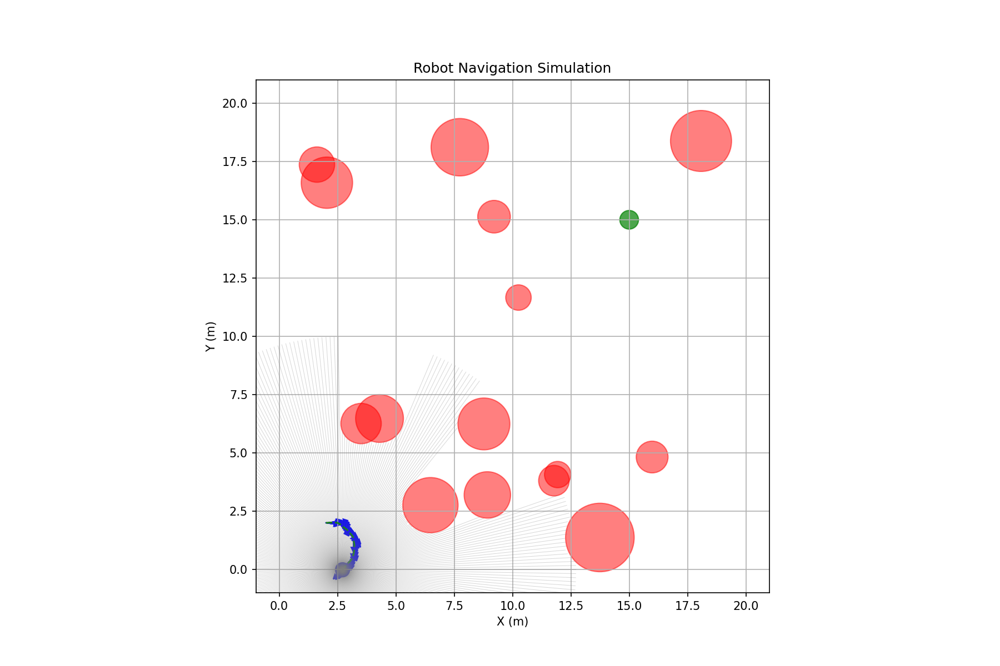
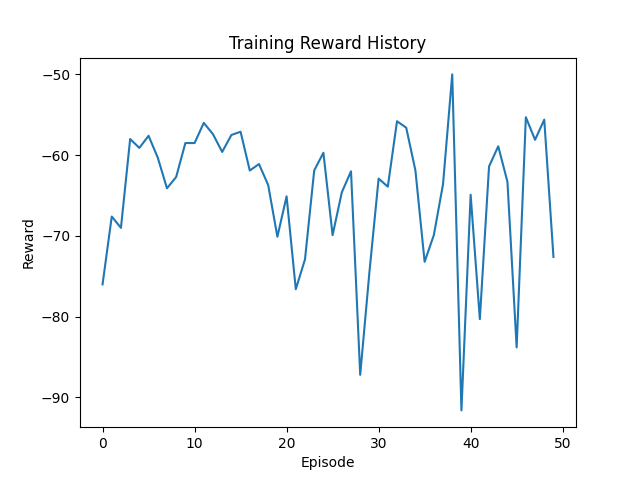
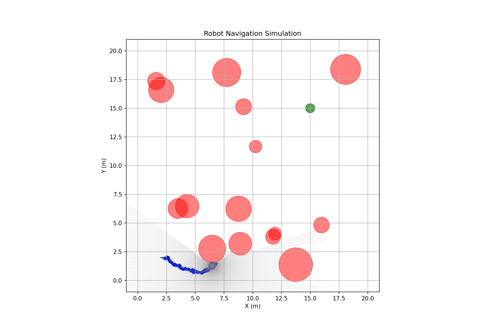
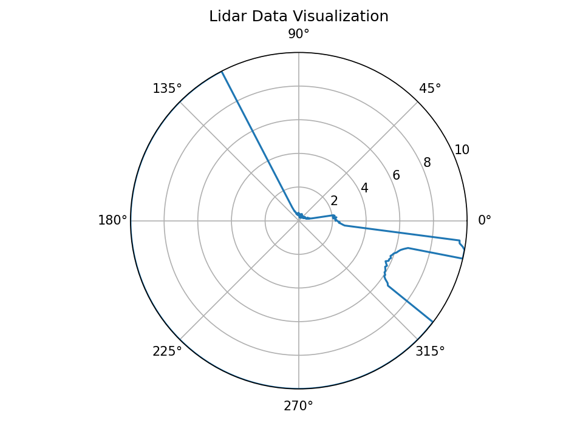

# 基于深度强化学习的机器人自主导航系统

---

## 📋 项目背景

### 研究意义

随着智能机器人技术的快速发展，自主导航已成为机器人领域的核心技术之一。传统的路径规划方法依赖于预先构建的环境地图，难以应对复杂多变的实际场景。深度强化学习（Deep Reinforcement Learning）通过端到端的学习方式，使机器人能够直接从传感器数据中学习最优策略，在未知环境中实现自适应导航。

### 技术挑战

| 挑战 | 描述 |
|------|------|
| **环境感知** | 如何高效获取并处理环境信息 |
| **实时决策** | 如何在复杂环境中做出快速准确的决策 |
| **避障能力** | 如何有效规避静态和动态障碍物 |
| **泛化能力** | 如何使模型适应不同环境 |

### 解决方案

本项目采用深度Q网络（DQN）算法，结合激光雷达传感器，实现机器人在二维环境中的自主导航与实时避障。

---

## 🎯 项目介绍

### 项目概述

本项目实现了一个基于深度Q网络（DQN）的机器人自主导航系统，通过激光雷达环境感知和强化学习算法，实现机器人在复杂环境中的自主路径规划和实时避障。

### 核心功能

- ✅ **激光雷达感知**: 360度全方位环境扫描
- ✅ **DQN强化学习**: 端到端策略学习
- ✅ **实时避障**: 动态障碍物规避
- ✅ **路径规划**: 从起点到目标的最优路径
- ✅ **可视化分析**: 训练过程与结果可视化

### 技术架构

```
┌─────────────────────────────────────────────────────────┐
│                    机器人导航系统                         │
├─────────────────────────────────────────────────────────┤
│  环境感知层                                              │
│  ├─ 激光雷达传感器（360度扫描）                          │
│  ├─ 障碍物检测与距离测量                                 │
│  └─ 环境状态编码（364维状态向量）                        │
├─────────────────────────────────────────────────────────┤
│  决策控制层                                              │
│  ├─ DQN深度强化学习网络                                  │
│  ├─ 经验回放机制（100K经验池）                           │
│  └─ ε-贪心探索策略                                       │
├─────────────────────────────────────────────────────────┤
│  执行层                                                  │
│  ├─ 5种控制动作（前进、左转、右转、原地转向）            │
│  └─ 实时避障与路径调整                                   │
└─────────────────────────────────────────────────────────┘
```

---

## 🧠 核心技术

### DQN算法原理

深度Q网络（Deep Q-Network）结合了深度学习与Q-Learning算法，使用神经网络逼近最优动作价值函数。

**核心公式**:
- Q(s, a) → 状态s下执行动作a的价值
- 目标Q值: r + γ × max(Q(s', a'))

### 网络结构

| 层类型 | 输出维度 | 说明 |
|--------|----------|------|
| 输入层 | 364 | 360维激光雷达 + 4维机器人状态 |
| 全连接层1 | 256 | 隐藏层，ReLU激活 |
| 全连接层2 | 128 | 隐藏层，ReLU激活 |
| 全连接层3 | 64 | 隐藏层，ReLU激活 |
| 输出层 | 5 | 5种动作的Q值 |

### 训练参数

| 参数 | 值 | 说明 |
|------|-----|------|
| 训练轮数 | 500 | 总训练轮数 |
| 最大步数 | 500 | 每轮最大步数 |
| 批次大小 | 64 | 经验回放批次 |
| 折扣因子 | 0.99 | 未来奖励权重 |
| 学习率 | 0.001 | Adam优化器 |
| ε初始值 | 1.0 | 探索率 |
| ε衰减 | 0.995 | 每轮衰减 |
| 记忆容量 | 100,000 | 经验回放池大小 |

---

## 📊 可视化结果

### 1. 导航过程可视化



**图1：机器人导航过程**

- **蓝色圆形**: 机器人当前位置
- **绿色圆形**: 目标点
- **红色圆形**: 障碍物
- **绿色虚线**: 机器人运动轨迹
- **灰色射线**: 激光雷达扫描线

### 2. 训练性能分析



**图2：训练奖励变化曲线**

**学习过程分析**:
- 初始阶段：奖励波动较大，探索行为频繁
- 中期阶段：奖励逐渐提升，学习效果显现
- 后期阶段：奖励趋于稳定，策略收敛

### 3. 测试结果可视化



**图3：测试阶段导航结果**

**性能指标**:
- 总奖励：反映导航效率
- 最终距离：与目标的接近程度
- 步数：完成任务的效率

### 4. 激光雷达数据可视化



**图4：激光雷达极坐标热力图**

**数据特征**:
- 极坐标展示360度扫描数据
- 距离信息通过半径表示
- 障碍物位置清晰可见

---

## 🔬 实验分析

### 奖励函数设计

```python
# 奖励计算
reward = 0
reward += distance_reward        # 距离奖励（靠近目标）
reward += collision_penalty      # 碰撞惩罚
reward += goal_reached_bonus      # 到达目标奖励
reward += time_penalty           # 时间惩罚
```

### 状态空间设计

| 状态维度 | 来源 | 说明 |
|----------|------|------|
| 360 | 激光雷达 | 360度方向的距离感知 |
| 1 | 目标方向 | 相对机器人的目标角度 |
| 1 | 目标距离 | 到目标的欧氏距离 |
| 1 | 机器人朝向 | 相对世界坐标的角度 |
| 1 | 角速度 | 当前角速度 |

### 动作空间设计

| 动作编号 | 动作 | 描述 |
|----------|------|------|
| 0 | 前进 | 向前移动 |
| 1 | 左转前进 | 左转45度并前进 |
| 2 | 右转前进 | 右转45度并前进 |
| 3 | 原地左转 | 原地左转45度 |
| 4 | 原地右转 | 原地右转45度 |

---

## 📁 项目结构

```
robot_navigation_system/
├── config.py                  # 配置文件
├── environment.py             # 导航环境模拟
├── dqn_agent.py               # DQN强化学习代理
├── visualization.py           # 可视化模块
├── train.py                   # 训练脚本
├── test.py                    # 测试脚本
├── main.py                    # 主程序入口
├── requirements.txt           # 依赖列表
│
├── navigation_episode_0.png   # 导航截图
├── training_reward.png        # 训练曲线
├── test_navigation_result.png # 测试结果
├── lidar_heatmap.png          # 激光雷达热力图
│
├── PROJECT_REPORT.md          # 项目详细报告
├── REPORT_SUMMARY.md          # 项目简洁汇报
├── README.md                  # 项目说明
│
└── dqn_navigation_model.pth   # 训练模型
```

---

## 🚀 使用说明

### 环境要求

- Python 3.8+
- PyTorch 2.2+
- NumPy
- Matplotlib

### 安装依赖

```bash
pip install -r requirements.txt
```

### 训练模型

```bash
python train.py
```

### 测试模型

```bash
python test.py
```

---

## 📈 性能评估

### 系统优势

| 优势 | 说明 |
|------|------|
| **端到端学习** | 从原始传感器数据直接学习控制策略 |
| **实时避障** | 激光雷达提供360度环境感知 |
| **自适应能力** | DQN网络适应不同环境布局 |
| **可扩展性** | 支持添加更多传感器和动作 |

### 技术创新点

1. **多模态状态表示**
   - 融合激光雷达距离信息
   - 整合机器人位置、方向、目标信息
   - 364维状态向量全面描述环境

2. **经验回放机制**
   - 打破数据相关性
   - 提高样本利用率
   - 稳定训练过程

3. **目标网络更新**
   - 软更新策略（τ=0.001）
   - 提高训练稳定性
   - 减少振荡现象

---

## 🎯 应用场景

| 场景 | 描述 |
|------|------|
| 🏠 **室内机器人导航** | 家庭服务机器人的自主移动 |
| 📦 **仓储物流自动化** | AGV小车的路径规划与避障 |
| 🤖 **服务机器人** | 餐厅、医院等场景的自主导航 |
| 🚗 **无人车避障** | 低速自动驾驶的障碍物规避 |

---

## 🔮 未来展望

### 短期改进

- [ ] 尝试Double DQN、Dueling DQN等改进算法
- [ ] 引入注意力机制增强特征提取
- [ ] 增加动态障碍物环境训练

### 长期规划

- [ ] 多智能体协同导航
- [ ] 真实机器人部署验证
- [ ] 3D环境导航扩展
- [ ] 视觉+激光雷达融合

---

## 📚 参考文献

1. Mnih, V., et al. "Human-level control through deep reinforcement learning." Nature, 2015.
2. Sutton, R. S., & Barto, A. G. "Reinforcement learning: An introduction." MIT press, 2018.
3. Lillicrap, T. P., et al. "Continuous control with deep reinforcement learning." ICLR, 2016.

---

## 👨‍💻 作者信息

**项目完成日期**: 2026年5月7日

**开发环境**: Python 3.14 + PyTorch 2.11

**技术栈**: Python + PyTorch + DQN + Matplotlib

---

## ⭐ 支持

如果你觉得这个项目对你有帮助，欢迎给我一个 Star！

---

<p align="center">
  
  
</p>